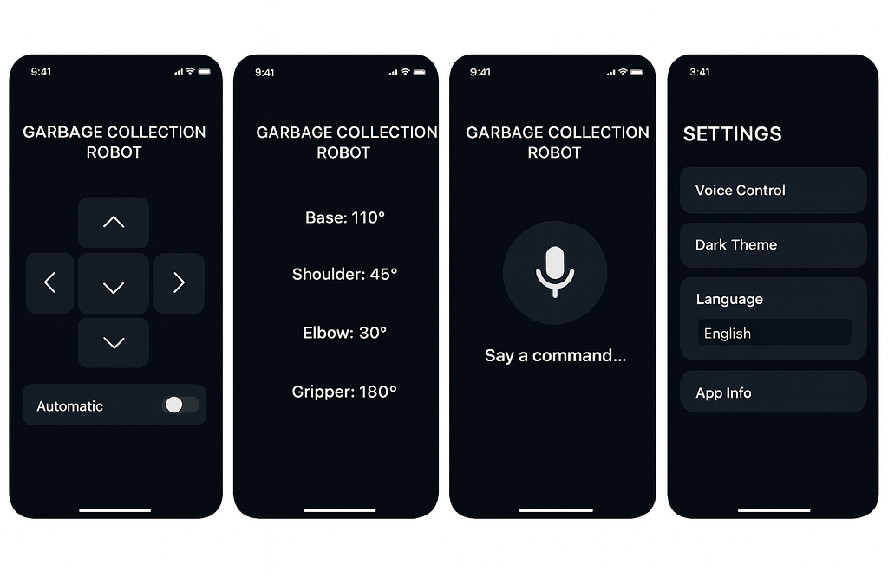

# Smart Garbage Collecting Robot 🤖  

  
  
  
 

A **Smart Garbage Collecting Robot** built with **Arduino Uno** and **ESP32-CAM (Bluetooth)** for wireless control.  
The robot supports **manual, automatic, and voice control modes**, detects obstacles using **HC-SR04 ultrasonic sensor**, and features a **4-DOF servo robotic arm** for grabbing and disposing of objects. A custom **Flutter mobile app** provides seamless control with live servo angle display and theme toggle.  

---
## 🚀 Features
- **Arduino Uno Controlled** – Core microcontroller for reliable operations.  
- **ESP32-CAM (Bluetooth)** – Wireless communication with mobile app.  
- **Dual Modes** – Manual control via app + Automatic obstacle avoidance.  
- **Voice Commands** – English/Bangla speech recognition for movement.  
- **4-Wheel Drive** – Smooth movement with L298N motor driver.  
- **Ultrasonic Obstacle Detection** – HC-SR04 sensor.  
- **4-DOF Robotic Arm** – Base, Shoulder, Elbow, Gripper control.  
- **Default Arm Reset** – Smooth return to initial position.  
- **Future Expansion** – TensorFlow Lite on ESP32-CAM for AI garbage detection.  

---

## 🛠 Hardware Requirements
- Arduino Uno R3  
- ESP32-CAM (used for Bluetooth communication)  
- L298N Motor Driver  
- 4× DC Motors (chassis)  
- HC-SR04 Ultrasonic Sensor  
- 4× Servo Motors (arm)  
- Power Supply (9–12V battery + 5V regulator)  

---

## 🖥 Software Requirements
- **Arduino IDE** (for microcontroller programming)  
- **Flutter SDK** (for mobile app development)  
- **Proteus** (for circuit design & simulation)  
- **speech_to_text** Flutter package (for voice recognition)  

---

## 📂 Project Structure
smart-garbage-collecting-robot/
│── arduinocode/
│ └── arduinocode.ino
│── robotController/
│ └── lib/main.dart
│── proteus-design/
│ └── schematic.png
│── images/
│ └── app-ui.png
│ └── robot-photo.jpg
│── README.md

---

## 📱 Mobile App Screens
- **Device Page** – Bluetooth device selection, theme toggle.  
- **Mode Selection** – Manual, Automatic, Voice Mode.  
- **Manual Control** – Gamepad-style car controls + Arm controls with live servo angles.  
- **Voice Mode** – Microphone button, real-time text display (English/Bangla).  

---

## 🔬 Outcome & Impact
This project shows how **IoT, robotics, and automation** can improve **waste management**.  
It reduces **human effort and health risks**, and promotes **sustainability**.  

---

## 📈 Future Work
- Integrate **TensorFlow Lite** on ESP32-CAM for smart garbage detection.  
- Add **camera-based object classification**.  
- Improve **power management** with solar charging.

## 📜 References
- [Arduino UNO Rev3 Docs](https://docs.arduino.cc/hardware/uno-rev3)  
- [ESP32-CAM Datasheet](https://www.espressif.com/sites/default/files/documentation/esp32_datasheet_en.pdf)  
- [HC-SR04 Ultrasonic Sensor](https://elecfreaks.com/learn-en/sensor/ultrasonic-module-hc-sr04.html)  
- [L298N Motor Driver Datasheet](https://www.st.com/resource/en/datasheet/l298.pdf)  
- [Flutter Documentation](https://docs.flutter.dev/)  

---

## 📷 Screenshots
  
  

---

## ⚖️ License
This project is released under the **MIT License**. You are free to use, modify, and distribute with attribution.
